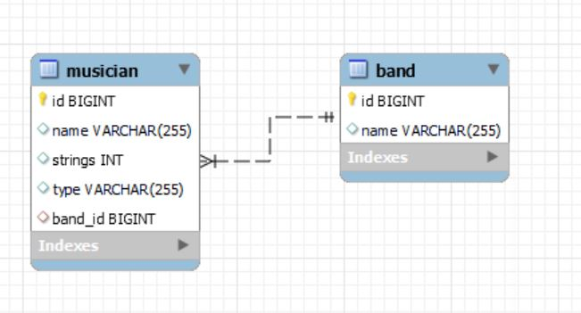

# project
##Overview
This project is backend of Online Fashion House, meant for fetching data from the MySQL database and expose the data using RESTFUL API endpoints.
Features:-
  * We can add a new customer
  * DElete a customer
* Top layer
  * Mid Layer
  * Mid layer2
    * Low layer 

operations
   1. add
   2. delete
## This is project structure 

